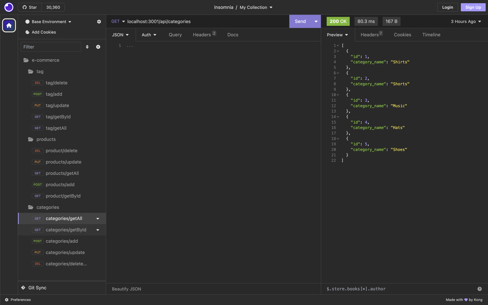
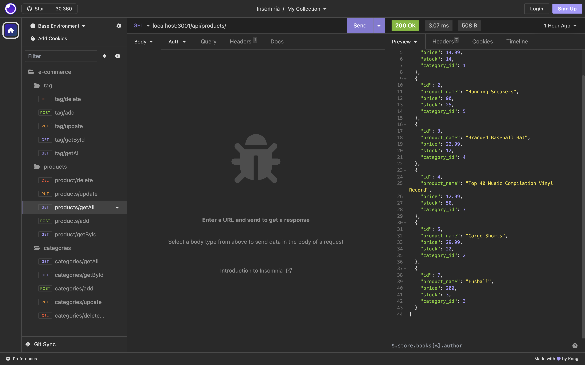
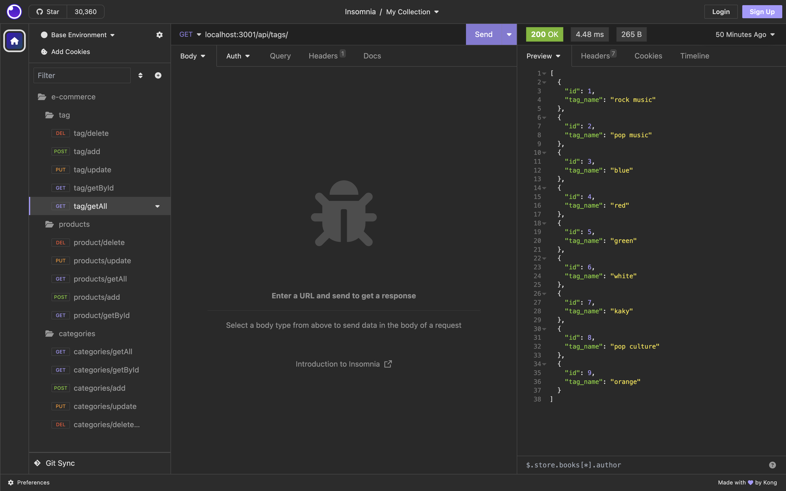

# e-commerce simulator

This application you can run it by typing node server.js in terminal, and then by using Insomnia to see all the end point in the routes for categories product and tag. the data will be displayed in a JSON format in order to create, update and delete the data in the database. 

# Images

